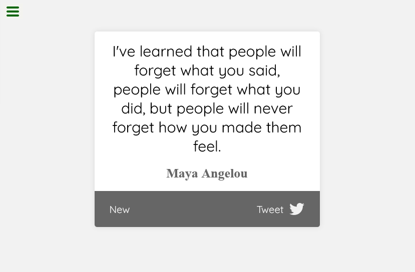

# FreeCodeCamp - Random Quote Machine

This is my solution to [Random Quote Machine challenge](https://www.freecodecamp.org/learn/front-end-development-libraries/front-end-development-libraries-projects/build-a-random-quote-machine).

The site was built with Webpack bundler and Tailwind styles.
Quotes are taken from [GoodReads](https://www.goodreads.com/quotes).

## Screenshot

## How it works

File *server.js* contains configuration for the json-server, which is started via running '*npm run start*' script. Heroku looks for *index.html* in the */public*, and this page fetches data from json-server.

## Ideas for improvement

- [ ] *randomId* range is hardcoded, fetch the number of quotes from db;
- [ ] app always fetches the first quote from db, make it random;
- [ ] prevent app from fetching the same quote two times in a row;
- [ ] improve design.